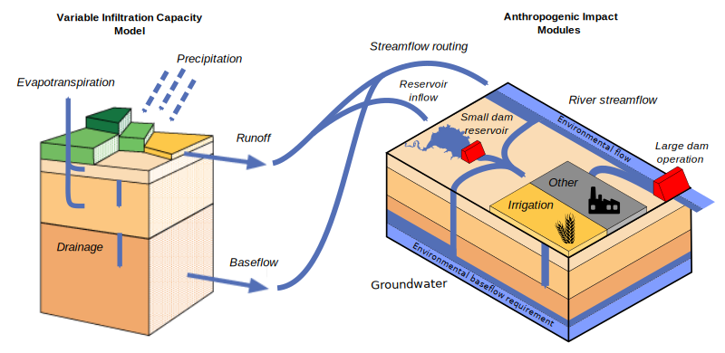

# VIC-WUR Model Overview

## Main Features

The VIC-WUR model ([Droppers et al., 2019](../Documentation/References_vicwur.md)) is a large-scale semi-distributed hydrological model which is used to assess the human impact on global water resources. As such, several modules are included:

1. Anthropogenic water withdrawal, consumption and return flow for the irrigation, domestic, energy, manufacturing and livestock sector. Water demands for the irrigation sector are calculated by the model while the other sectors require demand (potential withdrawal) inputs.
	- This feature is combined with an integrated routing module
2. Environmental flow requirements for terrestrial ecosystems. Flow requirements are seperated into:
	- Streamflow requirements that limit surface water withdrawals
	- Baseflow requirements that limit groundwater withdrawals
3. Dam reservoir operation. Dam operation is seperated into operations for 'small' (within grid) dams and 'large' dams.

Figure 1: The VIC-WUR model framework

## Integrated routing
Since VIC-5 uses the space-before-time processing order, runoff routing could be simulated each timestep. The routing post-process was replaced by our newly developed routing module which simulates routing sequentially (upstream-to-downstream) to facilitate water withdrawals between cells.

Routing is based on so-called 'unit-hydrographs' (or 'impuls-responce functions'). VIC-WUR uses 2 unit-hydrographs per cell: 1 for the cell runoff (`uh-runoff`) and 1 for the cell inflow (from upstream cells) (`uh_inflow`). See [Droppers et al., 2019](../Documentation/References_vicwur.md) for more information on how this was calculated in the past.

### Routing inflow forcing
VIC-WUR supports routing inflow forcing data to provided additional water inflow to specific cells. Forcings can be provided at various temporal resolutions (e.g. `FORCE_STEP`, `FORCE_DAY`, `FORCE_MONTH`).

## Water withdrawal, consumption and return flow
VIC-WUR simulates water withdrawal, consumption and return flow for the sectors:

1. Irrigation sector
2. Domestic sector
3. Energy sector
4. Manufacturing sector
5. Livestock sector

To meet water demands (given as forcing input), water can be withdrawn from river streamflow, small (within-grid) reservoirs and groundwater resources. Streamflow withdrawals are abstracted from the grid cell discharge (as generated by the routing module), reservoir withdrawals are abstracted from small dam reservoirs (located in the cell) and groundwater withdrawals are abstracted from the third layer soil moisture. Surface water withdrawals are partitioned between river streamflow and small reservoirs relative to water availability.

When water demands cannot be met, water withdrawals are partitioned between the sectors relative to their demands, restricting each sector by the same relative amount. Withdrawn water is partly consumed, meaning the water evaporates and does not return to the hydrological model. Unconsumed water withdrawals for the domestic, energy, manufacturing and livestock sector are returned as river streamflow. For the irrigation sector, unconsumed irrigation water remains in the soil column and eventually returns as subsurface runoff.

### Water demand, groundwater and consumption forcing
In VIC-WUR, sectoral water demands, groundwater withdrawal fraction and consumption fraction need to be specified for each grid cell. Forcings can be provided at various temporal resolutions (e.g. `FORCE_STEP`, `FORCE_DAY`, `FORCE_MONTH`, `FORCE_YEAR`). Sectors are dynamically included if all forcing files (e.g. demand, groundwater and consumption) are provided. See [Droppers et al., 2019](../Documentation/References_vicwur.md) for more information on how this was calculated in the past.

### Dynamic irrigation demand calculation
Instead of specifying the irrigation demand via forcing inputs, irrigation can also be calculated dynamically based on the model state. Irrigation demands are set when the soil moisture contents are below the critical point (`Wcr`) and will try to fill soil moisture up to the critical point ('`Wcr`').

The exception is paddy rice irrigation, where irrigation was also supplied to keep the upper soil layer saturated. Paddy irrigated vegetation can be specified in the irrigation parameters. The saturated soil conductivity in the upper 2 layers is reduced (`Ksat_expt`) to simulate puddling practices.

Total irrigation demands also included transportation and application losses. Note that transportation and application losses are not ‘lost’ but rather returned to the soil column without being used by the crop. Total irrigation demands are adjusted by the irrigation efficiency (`irrigation_efficiency`). Paddy irrigation used an irrigation efficiency of 1 since the water losses were already incorporated in the water demand calculation.

## Environmental flow requirement
Water withdrawals can be constrained by environmental flow requirements (EFRs). These EFRs specify the timing and quantity of water needed to support terrestrial river ecosystems. Surface and groundwater withdrawals are constrained separately in VIC-WUR, based on the EFRs for streamflow and baseflow respectively. EFRs for streamflow specify the minimum river streamflow requirements while EFRs for baseflow specify the minimum subsurface runoff  requirements (from groundwater to surface water). Since baseflow is a function groundwater availability in the hydrological model, baseflow requirements are used to constrain groundwater withdrawals.

### Environmental flow requirement forcing
In VIC-WUR, EFRs need to be specified for each grid cell. Forcings can be provided at various temporal resolutions (e.g. `FORCE_STEP`, `FORCE_DAY`, `FORCE_MONTH`, `FORCE_YEAR`). EFRs are dynamically included if forcing files (e.g. discharge and baseflow) are provided. See [Droppers et al., 2019](../Documentation/References_vicwur.md) for more information on how this was calculated in the past.

## Dam operation
In VIC-WUR a distinction is made between ‘small’ dam reservoirs (with an upstream area smaller than the cell area) and ‘large’ dam reservoirs. Small dam reservoirs act as buckets that fill using surface runoff of the grid-cell they are located in and reservoirs storage can be used for water withdrawals in the same cell. Large dam reservoirs are located in the main river and used the operation scheme of Hanasaki et al. (2006). The scheme distinguishes between two dam types: (1) dams that do not account for water demands downstream (e.g. hydropower dams or flood protection dams) and (2) dams that do account for water demand downstream (e.g. irrigation dams). For dams that do not account for demands, dam release is aimed at reducing annual fluctuations in discharge. For dams that do account for demands, dam release is additionally adjusted to provide more water during periods of high demand.

The scheme was adjusted slightly to account for monthly varying EFRs and to reduce overflow releases. For more information about the large-dam operation scheme, [click here](DamOperationText.md).
